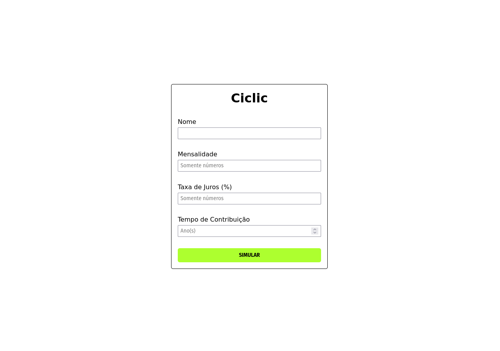
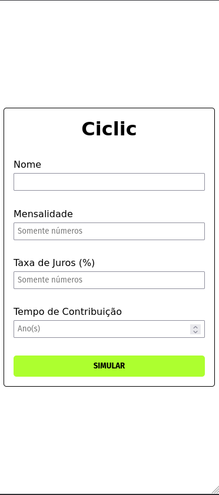

# Desafio | Teste Técnico Juros Compostos

- Teste para a vaga de Frontend Developer Júnior.

- O teste aborda conhecimentos em HTML, CSS e Javascript.

## Índice

- [Visão Geral](#visao-geral)
  - [Sobre o desafio](#sobre-o-desafio)
  - [Screenshot](#screenshot)
  - [Links](#links)
  - [Como utilizar o site](#como-utilizar-o-site)
- [Meu processo](#meu-processo)
  - [Construído com](#construido-com)
  - [O que eu aprendi](#o-que-eu-aprendi)
- [Autor](#autor)

## Visao Geral

### Sobre o desafio

Construa uma aplicação que fará uma simulação de investimento utilizando juros compostos. A aplicação terá duas telas.

### Screenshot





### Links

- URL do repositório: [solução](https://github.com/thiagoa-martins/teste-juros-compostos)
- URL do site: [github pages](https://thiagoa-martins.github.io/teste-juros-compostos/)

### Como utilizar o site

- Acesse a URL do site acima
- Informe seus dados ou dados fictícios
- Experimente navegar nos formulários com TAB, ENTER ou o mouse
- Informe seus dados e envie
- Caso esteja tudo certo os dados serão enviados

## Meu processo

### Construido com

- Marcação HTML5 semântica
- Propriedades personalizadas de CSS
- Flexbox
- Primeiro fluxo de trabalho para desktop
- Javascript (Vanilla)


### O que eu aprendi

Neste projeto pude desenvolver principalmente minhas habilidades com Javascript, consumi dados de uma API com requisição POST, validação de dados enviados pelo usuário com apenas números e vígula, boas práticas de programação como organização e reutização de código com funções.

Além de obter e melhorar conhecimentos de Html e Css como:  posicionamento de elementos, estilização, semântica, flexbox e responsividade.

```js
inputMonthlyPayment.addEventListener("keypress", function(e) {

    const keyCode = (e.keyCode ? e.keyCode : e.wich);

    if((keyCode > 47 && keyCode < 58) || (keyCode == 44)) {

        if(keyCode == 44) {
    
            if(countCommaX == 0) {
                countCommaX += 1;
            } else {
                e.preventDefault();
            }    
        }
    } else {
        e.preventDefault();
    }

    inputMonthlyPayment.addEventListener("keydown", function(e) {

        const keyCode = (e.keyCode ? e.keyCode : e.wich);

        if(keyCode == 8 && countCommaX == 1) {
            countCommaX -= countCommaX;
        }
    });
});

   if(!hasError) {

    const valueMonthlyPayment = inputMonthlyPayment.value;
    
    const valueMonthlyPaymentFormat = valueMonthlyPayment.replace(",", "");

    const valueInputInterestRate = inputInterestRate.value;

    const valueInputInterestRateFormat = valueInputInterestRate.replace(",", "");

    const configs = {
        method: "POST",
        body: `{ "expr": "${valueMonthlyPaymentFormat} * (((1 + 0.0${valueInputInterestRateFormat}) ^ ${inputContributionTime.value * 12} - 1) / 0.0${valueInputInterestRateFormat})" }`
    }

    let content = ""; 

    fetch("https://api.mathjs.org/v4/", configs)
    .then(returnFromAPI)
    .then(displayData)

    function returnFromAPI(response) {
        return response.json();
    }

    function displayData(response) {
        const result = parseFloat(response.result);

        const resultFormatFloat = result.toFixed(2);
        const resultFormatString = resultFormatFloat.replace(".", ",");

        content = `
            <h1>Ciclic</h1>

            <fieldset>
                <label>Olá ${inputName.value},</label>
                <label>investindo <strong>R$ ${inputMonthlyPayment.value}</strong> todo mês,</label>
                <label>você terá <strong>R$ ${resultFormatString}</strong> em <strong>${inputContributionTime.value} anos</strong></label>
                <label> sob uma taxa de juros de <strong>${inputInterestRate.value}%</strong> ao mês.</label>
            </fieldset>

            <fieldset>
                <button id="buttonSimulateAgain">Simular Novamente</button>
            </fieldset>
        `;

        form.style.display = "none";

        inputName.value = "";
        inputMonthlyPayment.value = "";
        inputInterestRate.value = "";
        inputContributionTime.value = "";

        formResult.classList.add("form");
        formResult.innerHTML = content;

        formResult.style.display = "block"

        const buttonSimulateAgain = document.getElementById("buttonSimulateAgain");

        buttonSimulateAgain.addEventListener("click", function() {
            formResult.style.display = "none";
            form.style.display = "block";     
        });
    }
}
```

## Autor

- Github - [thiagoa-martins](https://github.com/thiagoa-martins)
- Twitter - [thiagoa_martins](https://www.twitter.com/thiagoa_martins)
